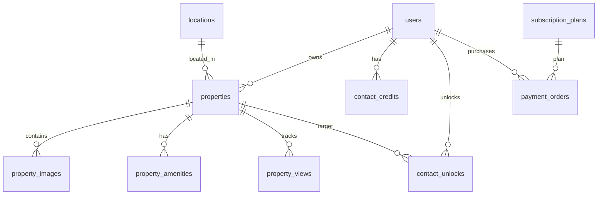

# QA Discovery Report — Property Portal Architecture & Inventory

**Audit Date:** September 17, 2026  
**System Name:** AuraHomes Property Portal  
**Scope:** Full-stack Architecture, Frontend Routes, Backend APIs, Database Models, Security Roles, Data Flows, and External Services.

---

## 1. System Overview & Technology Stack

- **Frontend:** Next.js 16 (App Router, Turbopack), React 19, TypeScript, Vanilla CSS Design System (`globals.css`).
- **Backend:** Python FastAPI (v0.109+), Async SQLAlchemy 2.0 ORM, Pydantic v2 schemas, Alembic database migrations.
- **Database:** PostgreSQL (Production / Supabase) / SQLite (Development & Local Test Async Engine).
- **Authentication:** JWT (Access Token 30-min TTL, Refresh Token 30-day TTL), bcrypt password hashing, SMS/OTP service interface, HttpOnly Cookie + Header Bearer auth.
- **Storage:** Cloudinary CDN for property image processing (card, detail, thumbnail auto-transformation) with fallback to local upload storage.
- **Monetization:** Razorpay Order Creation & Webhook Signature Verification for Contact Credit Plans (Silver, Gold, Platinum).

---

## 2. Frontend Architecture & Route Inventory

### Public & Marketing Pages (12 Routes)
1. `/` — Homepage featuring Hero Search Widget, Purpose Tabs (Buy/Rent/Commercial), and Featured Listings Grid.
2. `/search` — Full Property Search Page with Filter Sidebar (price slider, BHK, property type, location, purpose, sorting).
3. `/properties/[id]` — Property Details Page with Photo Gallery, Thumbnail Strip, Specs, Amenities, Unlock Contact Flow, Share.
4. `/plans` — Contact Credit Subscription Plans listing.
5. `/pricing` — Pricing Overview & Feature Matrix.
6. `/checkout/[plan_id]` — Razorpay Payment Checkout Page.
7. `/payment/success` — Payment Confirmation Page.
8. `/payment/failed` — Payment Failure & Retry Page.
9. `/contact` — Support & Inquiry Page.
10. `/about` — About AuraHomes Portal.
11. `/privacy-policy` — Legal Privacy Policy.
12. `/terms-of-service` — Terms & Conditions.

### Authentication & Account Recovery (5 Routes)
13. `/login` — Customer/Seller Account Login with email/mobile and password.
14. `/register` — Customer Registration Page (Role selection: Buyer, Owner, Agent).
15. `/reset-password` — Password Reset Request & OTP Verification Page.
16. `/verify-otp` — Mobile Number OTP Verification Page.
17. `/admin/login` — Dedicated Admin Portal Login.

### User Dashboard (6 Routes)
18. `/dashboard` — Seller Overview Dashboard (Active listings, views, leads, quick actions).
19. `/dashboard/properties` — My Listed Properties (Status toggles: Published/Deactivated, Edit link, Prune).
20. `/dashboard/properties/new` — 10-Step Property Creation Wizard (Purpose, Type, Location, Specs, Amenities, Price, Photos, Description, Contact, Preview).
21. `/dashboard/properties/[id]/edit` — Property Edit Page.
22. `/dashboard/analytics` — Seller Property Performance Analytics.
23. `/dashboard/notifications` — User Notification History.
24. `/account/profile` — User Profile Management & Role Upgrade.

### Admin Dashboard (12 Routes)
25. `/admin/dashboard` — Platform Performance Metrics & Quick Approval Feed.
26. `/admin/properties` — Master Property Approvals, Verification, Promoted Feature Toggle, Pruning.
27. `/admin/users` — User Account Moderation (Active/Suspended/Blocked).
28. `/admin/locations` — Persistent City/Locality Management (Add, Edit, Toggle, Prune).
29. `/admin/categories` — Category Configuration (Add, Edit, Toggle, Prune).
30. `/admin/featured` — Promoted Featured Listings Management.
31. `/admin/subscriptions` — Active Subscriptions Management.
32. `/admin/payments` — Transaction History & Razorpay Verification Log.
33. `/admin/reports` — Content Reporting & Fraud Moderation Feed.
34. `/admin/notifications` — Platform Notification Broadcast Center & History.
35. `/admin/analytics` — System Analytics & Financial Metrics.

---

## 3. Backend Architecture & API Endpoint Inventory

### Authentication & User Endpoints (`/api/v1/auth`, `/api/v1/users`)
- `POST /api/v1/auth/register` — User registration with email/mobile duplicate check.
- `POST /api/v1/auth/login` — Authentication & JWT issuance (Access + Refresh).
- `POST /api/v1/auth/send-otp` — Rate-limited mobile OTP generation.
- `POST /api/v1/auth/verify-otp` — Mobile verification.
- `POST /api/v1/auth/refresh` — Silent JWT access token renewal.
- `POST /api/v1/auth/logout` — Revoke cookies/session.
- `POST /api/v1/auth/request-password-reset` — Password reset trigger.
- `POST /api/v1/auth/reset-password` — Password reset confirmation.
- `GET /api/v1/users/me` — Current user profile.
- `PUT /api/v1/users/me` — Update user profile details.
- `PUT /api/v1/users/me/change-password` — Change password.

### Property Management & Search (`/api/v1/properties`, `/api/v1/search`)
- `GET /api/v1/search` — Filtered property lookup with pagination & sorting.
- `POST /api/v1/properties` — Create property listing with atomic DB transaction.
- `GET /api/v1/properties/{id}` — Fetch detailed property record.
- `PUT /api/v1/properties/{id}` — Update property specifications & images.
- `DELETE /api/v1/properties/{id}` — Delete property listing (owner/admin).
- `GET /api/v1/properties/me/listings` — Fetch user's own listings.
- `GET /api/v1/properties/me/dashboard-stats` — Fetch seller analytics & counts.
- `GET /api/v1/properties/deactivated` — Fetch deactivated property IDs.
- `POST /api/v1/properties/{id}/images` — Upload property image.
- `DELETE /api/v1/properties/{id}/images/{image_id}` — Remove image.
- `PATCH /api/v1/properties/{id}/images/reorder` — Reorder gallery images.
- `POST /api/v1/properties/{id}/view` — Track property page view.

### Contact Unlocking & Monetization (`/api/v1/contacts`, `/api/v1/payments`)
- `POST /api/v1/contacts/unlock/{property_id}` — Spend 1 credit to unlock owner phone/email.
- `GET /api/v1/contacts/credits` — Get current user contact credit balance.
- `GET /api/v1/payments/plans` — Fetch active credit subscription plans.
- `POST /api/v1/payments/create-order` — Initialize Razorpay order.
- `POST /api/v1/payments/verify` — Verify Razorpay payment signature & grant credits.

### Admin Management (`/api/v1/admin`)
- `GET /api/v1/admin/dashboard` — Platform-wide counters.
- `GET /api/v1/admin/properties` — Master property approval list.
- `POST /api/v1/admin/properties/{id}/approve` — Approve listing.
- `POST /api/v1/admin/properties/{id}/reject` — Reject listing.
- `POST /api/v1/admin/properties/{id}/verify` — Mark verified.
- `PATCH /api/v1/admin/properties/{id}/feature` — Promote/feature listing.
- `DELETE /api/v1/admin/properties/{id}` — Admin delete property.
- `GET /api/v1/admin/users` — Moderate users.
- `PATCH /api/v1/admin/users/{id}/status` — Update user status (active/suspended/blocked).
- `GET /api/v1/admin/payments` — Master payment order logs.
- `GET /api/v1/admin/reports` — User report feed.
- `PATCH /api/v1/admin/reports/{id}` — Moderate report status.
- `POST /api/v1/admin/notifications/broadcast` — Send broadcast notification.
- `GET /api/v1/admin/notifications/history` — Fetch broadcast history.
- `GET /api/v1/admin/locations` — Fetch persistent locations.
- `POST /api/v1/admin/locations` — Add location.
- `PUT /api/v1/admin/locations/{id}` — Edit location.
- `PATCH /api/v1/admin/locations/{id}/toggle` — Toggle location active state.
- `DELETE /api/v1/admin/locations/{id}` — Delete location.
- `GET /api/v1/admin/categories` — Fetch categories.
- `POST /api/v1/admin/categories` — Add category.
- `PUT /api/v1/admin/categories/{id}` — Edit category.
- `PATCH /api/v1/admin/categories/{id}/toggle` — Toggle category active state.
- `DELETE /api/v1/admin/categories/{id}` — Delete category.
- `GET /api/v1/admin/analytics` — Platform financial & user growth metrics.

### Additional Features (`/api/v1/notifications`, `/api/v1/favorites`, `/api/v1/reports`, `/api/v1/saved-searches`, `/api/v1/images`)
- `GET /api/v1/notifications` — User notification feed.
- `PATCH /api/v1/notifications/{id}/read` — Mark notification read.
- `POST /api/v1/reports` — File property report.
- `GET /api/v1/favorites` — Fetch user saved favorite listings.
- `POST /api/v1/favorites/{property_id}` — Save property to favorites.
- `DELETE /api/v1/favorites/{property_id}` — Remove from favorites.
- `GET /api/v1/saved-searches` — Fetch saved search filters.
- `POST /api/v1/saved-searches` — Create saved search.
- `DELETE /api/v1/saved-searches/{id}` — Remove saved search.
- `POST /api/v1/images/upload` — Upload files to Cloudinary CDN.

---

## 4. Database Schema Architecture

---

## 5. Security & Permission Matrix

| Role | Browse & Search | View Contact | Post Property | Edit/Delete Own | Admin Dashboard | Moderate Content |
| ---- | --------------- | ------------ | ------------- | --------------- | --------------- | ---------------- |
| **Guest / Anonymous** | ✅ Allowed | ❌ Requires Auth & Credits | ❌ Redirects to Login | ❌ Denied | ❌ Denied | ❌ Denied |
| **Buyer Account** | ✅ Allowed | ✅ Requires Credits | ❌ Role Upgrade Required | ❌ Denied | ❌ Denied | ❌ Denied |
| **Owner Account** | ✅ Allowed | ✅ Requires Credits | ✅ Allowed | ✅ Allowed | ❌ Denied | ❌ Denied |
| **Agent Account** | ✅ Allowed | ✅ Requires Credits | ✅ Allowed | ✅ Allowed | ❌ Denied | ❌ Denied |
| **Admin Account** | ✅ Allowed | ✅ Free Unrestricted | ✅ Auto-Approved | ✅ Any Property | ✅ Full Access | ✅ Full Moderation |

---

## 6. Environment Dependencies & External Integrations

- `NEXT_PUBLIC_API_URL`: Points to backend FastAPI URL (`https://aurahomes-backend-tz1c.onrender.com/api/v1` or `http://localhost:8000/api/v1`).
- `DATABASE_URL`: Async PostgreSQL connection string.
- `JWT_SECRET_KEY` & `JWT_ALGORITHM`: HMAC-SHA256 signature verification.
- `CLOUDINARY_*`: Cloudinary CDN image upload & thumbnail transformation.
- `RAZORPAY_*`: Razorpay Payment Gateway integration.
