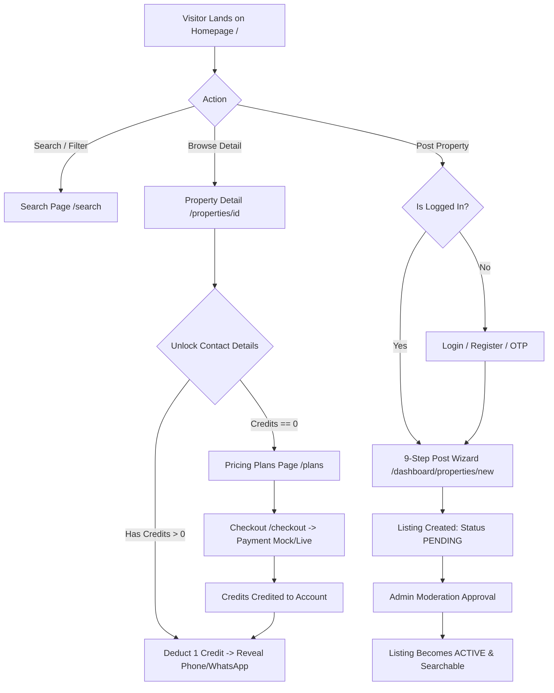
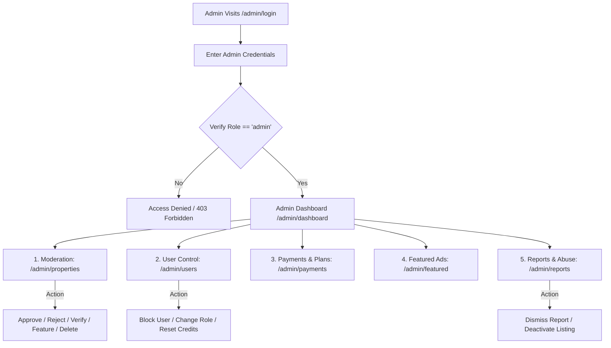
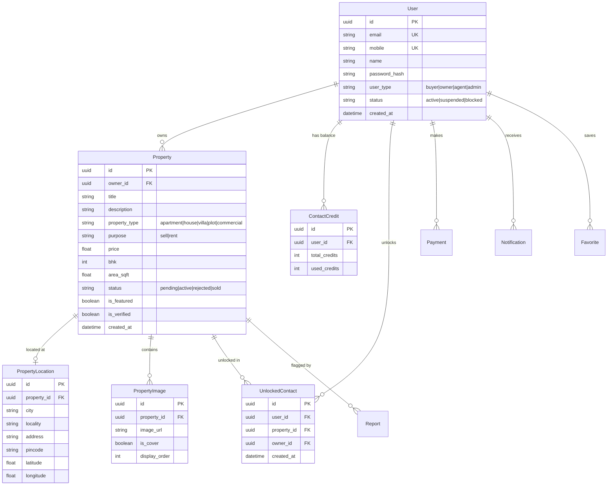

# AuraHomes Property Marketplace Portal — Complete System Manual & Technical Architecture

> **Document Version:** 1.0.0  
> **Last Verified & Synchronized:** August 2026  
> **Repository:** `https://github.com/sanjeev8085/property-portal.git`  
> **Live Production Deployments:**  
> - **Frontend (Vercel):** `https://property-portal-rncp.vercel.app`  
> - **Backend API (Render Cloud):** `https://aurahomes-backend-tz1c.onrender.com`  
> - **Interactive API Docs (Swagger):** `https://aurahomes-backend-tz1c.onrender.com/docs`

---

## Table of Contents

1. [Executive Summary & Technology Stack](#1-executive-summary--technology-stack)
2. [End-to-End User Flow (Buyer, Tenant, & Owner)](#2-end-to-end-user-flow-buyer-tenant--owner)
3. [End-to-End Admin Flow (Moderation & Operations)](#3-end-to-end-admin-flow-moderation--operations)
4. [Complete Screen & Page Inventory](#4-complete-screen--page-inventory)
5. [Authentication, RBAC, & Session Architecture](#5-authentication-rbac--session-architecture)
6. [Posting & Listing Workflow (9-Step Wizard)](#6-posting--listing-workflow-9-step-wizard)
7. [Contact Unlocking, Monetization, & Credit Gating](#7-contact-unlocking-monetization--credit-gating)
8. [Backend API Reference & Endpoint Directory](#8-backend-api-reference--endpoint-directory)
9. [Database Schema & Entity Relationships](#9-database-schema--entity-relationships)
10. [Media, File Uploads, & Storage Pipeline](#10-media-file-uploads--storage-pipeline)
11. [Notifications, SMS, & WhatsApp Communications](#11-notifications-sms--whatsapp-communications)
12. [Form Validations, Resilience, & Edge Case Handling](#12-form-validations-resilience--edge-case-handling)
13. [Implementation Reality & Integration Status](#13-implementation-reality--integration-status)
14. [Local Development, Testing, & Deployment Runbook](#14-local-development-testing--deployment-runbook)

---

## 1. Executive Summary & Technology Stack

AuraHomes is a full-stack, enterprise-grade real estate and property marketplace built specifically for the Indian real estate market. It supports residential and commercial buying, renting, flat-sharing, and PG/co-living listings with zero brokerage, verified owner identity, contact credit gating, and admin moderation workflows.

```
┌─────────────────────────────────────────────────────────────────────────────┐
│                          AuraHomes Architecture                             │
└─────────────────────────────────────────────────────────────────────────────┘

       Next.js 14 App Router (Vercel)           FastAPI Async REST (Render)
  ┌──────────────────────────────────────┐     ┌──────────────────────────────┐
  │  • React 18 + TypeScript             │     │  • Python 3.12 + FastAPI     │
  │  • Pure Vanilla CSS System           │◄───►│  • SQLAlchemy 2.0 Async (ORM)│
  │  • LocalStorage Session Client       │     │  • Pydantic v2 Schemas       │
  │  • Client-Side Fallback Cache        │     │  • Passlib (bcrypt) + JWT    │
  └──────────────────────────────────────┘     └──────────────┬───────────────┘
                                                              │
                                     ┌────────────────────────┴────────────────┐
                                     │                                         │
                                     ▼                                         ▼
                        SQLite / PostgreSQL Database              Storage & Notification
                        ┌──────────────────────────┐             ┌─────────────────────┐
                        │ • Users & RBAC Roles     │             │ • Cloudinary / Data │
                        │ • Properties & Locations │             │ • Direct WhatsApp   │
                        │ • Credits & Payments     │             │ • In-App Event Bus  │
                        │ • Notifications & Audits │             │ • Mock SMS Gateway  │
                        └──────────────────────────┘             └─────────────────────┘
```

### Core Technologies

| Layer | Technology | Primary Purpose & Configuration |
| :--- | :--- | :--- |
| **Frontend Framework** | Next.js 14 (App Router) | Server-Side Rendering (SSR), Client interactivity (`"use client"`), SEO metadata, dynamic routing. |
| **Frontend Language** | TypeScript / ESNext | Strict typing, domain interfaces, compilation validation. |
| **Styling & Design** | Vanilla CSS (`globals.css`) | Custom design system, responsive media queries, glassmorphism, mobile-optimized grids. |
| **Backend Framework** | FastAPI (Async ASGI) | High-concurrency async endpoints, OpenAPI automatic documentation, dependency injection. |
| **ORM & Database** | SQLAlchemy 2.0 Async + aiosqlite | Asynchronous queries, relation eager-loading (`selectinload`), foreign keys, constraints. |
| **Authentication** | JWT (HS256) + Bcrypt | Bearer token authorization, refresh token rotation, role claims (`sub`, `role`). |
| **Data Validation** | Pydantic v2 (Backend) + Custom Regex (Frontend) | Strict schemas, phone normalization (+91), email check, pincode validation. |
| **Test Suites** | Node.js Test Runner + Pytest | 25 Automated Frontend E2E / Unit tests + Comprehensive Pytest backend tests. |

---

## 2. End-to-End User Flow (Buyer, Tenant, & Owner)



### 2.1 Discovery & Browsing Flow
1. **Visitor Landing (`/`):**
   - User lands on the homepage with Hero search bar (Location auto-complete, Buy/Rent toggle, Category dropdown).
   - Quick City Carousel allows 1-click filtering by city (Bhopal, Indore, Jaipur, Pune, Bengaluru, Mumbai).
   - Featured Properties, verified listings, and recent listings display live cards with dynamic pricing format (`₹ Lakh`, `₹ Cr`, `₹ / Month`).
2. **Search & Filter Stream (`/search`):**
   - Users can filter across **Purpose** (`rent`, `sell`), **City/Locality** (`Bhopal`, `Arera Colony`), **Property Type** (`Apartment`, `Independent House`, `Villa`, `Plot`, `Commercial`), **BHK** (`1 BHK` to `5+ BHK`), and **Price Range Sliders**.
   - Filters update the URL query string (`/search?purpose=rent&city=Bhopal&bhk=2`) and fetch live backend data from `/api/v1/search`.
3. **Viewing Property Details (`/properties/[id]` or `/properties/[slug]`):**
   - **Hero Gallery:** Full-width image slider with thumbnail strip, badge indicators (`⭐ Verified`, `⚡ Fast Responder`).
   - **Quick Specs Grid:** 2-column mobile responsive spec tiles (Carpet Area, Configuration, Bathrooms, Furnishing, Parking, Maintenance).
   - **Amenities Chips:** Displays tagged amenities (Security, Lift, Power Backup, Gym, Covered Parking).
   - **Owner Identity Card:** Displays owner name, verification badge, and masked contact info.

### 2.2 Property Contact Unlocking Flow
1. If the logged-in user is the **Listing Owner**:
   - Page displays `👤 This is your property listing (Owner View)` with unmasked phone and email, plus a 1-click shortcut to `Manage Listing in Dashboard →`.
2. If the user is a **Buyer / Tenant**:
   - Contact numbers and emails are masked (`+91 98930 XXXXX`, `sa***@gmail.com`).
   - Clicking **"Unlock Owner Contact (1 Credit)"**:
     - Checks user credit balance (`GET /api/v1/users/me/credits`).
     - If `credits > 0`: Deducts 1 credit via `POST /api/v1/contacts/unlock`, permanently stores unlocked record, and reveals full unmasked phone number and direct WhatsApp click-to-chat button.
     - If `credits == 0`: Prompts the user with the Plans modal and redirects to `/plans`.

### 2.3 Account Registration & Profile Management
1. **Sign Up (`/register`):** Name, Email, 10-digit Indian mobile number, password, city, and role (`Individual Owner`, `Buyer`, `Agent`).
2. **Login (`/login`):** Email/password login with active account banner and 1-click account switching.
3. **Forgot / Reset Password (`/reset-password`):** Standalone recovery workflow allowing password changes using email or mobile.
4. **My Profile & Account Center (`/account/profile`):**
   - **Active Identity Banner:** Shows logged-in name, email, phone, city, and role badge.
   - **Profile Tab:** Update Full Name, Email, Mobile, City, and Account Type.
   - **Security Tab:** Live password updater with visibility toggle and strength verification.

---

## 3. End-to-End Admin Flow (Moderation & Operations)



### 3.1 Admin Authentication & RBAC Guard
- Admin route access is guarded by `AdminLayout.tsx` checking `localStorage.getItem("user_type") === "admin"`.
- All backend admin API calls (`/api/v1/admin/*`) require JWT tokens with `role: "admin"` decoded in backend dependency `get_current_admin_user`.
- Default Admin Credentials seeded on fresh database reset:
  - **Email:** `admin@aurahomes.in`
  - **Password:** `Admin@12345`

### 3.2 Admin Moderation & Management Modules

| Module | Route | Key Capabilities & Actions |
| :--- | :--- | :--- |
| **Executive Dashboard** | `/admin/dashboard` | High-level metrics: Total Active Listings, Pending Approvals, Total Registered Users, Gross Platform Revenue, Quick Approval Queue. |
| **Property Moderation** | `/admin/properties` | Filter by `All`, `Pending`, `Approved`, `Rejected`. Instant action buttons: **Approve (`status=ACTIVE`)**, **Reject (`status=REJECTED`)**, **Toggle Verified Badge**, **Feature Listing**, or **Delete**. |
| **User Directory** | `/admin/users` | View all registered owners, buyers, and agents. Filter by role/status. Actions: **Block / Suspend User**, **Activate User**, **Promote to Admin**, **Grant Bonus Credits**. |
| **Featured Listings** | `/admin/featured` | Manage homepage top-slot promoted properties with expiration date scheduling and priority weighting. |
| **Locations & Cities** | `/admin/locations` | Add/edit supported tier-1 and tier-2 Indian cities, localities, and postal codes. |
| **Categories & Types** | `/admin/categories` | Manage residential, commercial, and agricultural property category taxonomy. |
| **Subscription Plans** | `/admin/subscriptions` | Configure pricing tiers (Starter, Pro, Enterprise), unlock credit allocations, and validity duration. |
| **Payment Ledger** | `/admin/payments` | Audit all successful, failed, and refunded Razorpay/Mock transactions with gateway order IDs. |
| **Content Reports** | `/admin/reports` | Review flagged listings reported for fake pricing, misleading photos, or duplicate spam. Actions: **Dismiss**, **Take Down Listing**, **Warn Owner**. |
| **System Notifications** | `/admin/notifications` | Broadcast site-wide alerts, system updates, and promotional messages to all users. |
| **Platform Analytics** | `/admin/analytics` | Charts and breakdowns: Daily signups, revenue per city, rent vs sell listing distribution. |

---

## 4. Complete Screen & Page Inventory

### Public Pages (Frontend)

```
frontend/src/app/
├── page.tsx                     # Homepage (Hero search, categories, featured listings, testimonials)
├── search/page.tsx              # Property Search & Filter engine with query-param sync
├── properties/[id]/page.tsx     # Full Property Detailing view, gallery, specs, contact gating
├── plans/page.tsx               # Pricing plans & contact credit package cards
├── checkout/page.tsx            # Order confirmation & payment gateway launcher
├── payment/success/page.tsx     # Payment confirmation & receipt screen
├── login/page.tsx               # User & Owner Login with account switcher banner
├── register/page.tsx            # New user signup form with role selection
├── verify-otp/page.tsx          # 6-digit numeric mobile OTP verification screen
├── reset-password/page.tsx      # Standalone password recovery & reset screen
├── about/page.tsx               # About company, mission, zero-brokerage model
├── contact/page.tsx             # Contact support, inquiry form, office address
├── privacy-policy/page.tsx      # Legal privacy policy & data compliance
├── terms-of-service/page.tsx    # Terms of use, listing policies, refund terms
```

### User Dashboard Pages

```
frontend/src/app/
├── account/profile/page.tsx          # Profile management, identity badge, change password
├── dashboard/page.tsx                # Owner dashboard home, listing stats, fast actions
├── dashboard/properties/page.tsx     # Manage own listings (Activate, Deactivate, Edit, Delete)
├── dashboard/properties/new/page.tsx # 9-Step Post Property Wizard with photo upload
├── dashboard/analytics/page.tsx      # Listing performance, views, inquiries count
├── dashboard/interested-users/page.tsx# Leads ledger of buyers who unlocked owner contact
├── dashboard/notifications/page.tsx  # In-app notifications & inquiry alert feed
```

### Admin Control Suite Pages

```
frontend/src/app/admin/
├── login/page.tsx          # Dedicated admin portal login
├── dashboard/page.tsx      # Executive command center & quick queues
├── properties/page.tsx     # Listing moderation (Approve, Reject, Verify, Feature)
├── users/page.tsx          # User management, status toggling, credit grants
├── featured/page.tsx       # Homepage featured slot management
├── locations/page.tsx      # Cities, localities, and geographic zones
├── categories/page.tsx     # Property categories & taxonomy
├── subscriptions/page.tsx  # Plan pricing & credit tier builder
├── payments/page.tsx       # Transaction ledger & reconciliation
├── reports/page.tsx        # User dispute & fake listing report resolution
├── notifications/page.tsx  # Platform-wide broadcast dispatcher
├── analytics/page.tsx      # Business intelligence & growth metrics
```

---

## 5. Authentication, RBAC, & Session Architecture

### 5.1 Token & Session Storage Model
- **Access Token:** Short-lived JWT (`expires_in = 60m`) stored in browser `localStorage.getItem("access_token")`. Sent via `Authorization: Bearer <token>` in `apiFetch`.
- **Refresh Token:** Long-lived JWT (`expires_in = 30d`) stored in `localStorage.getItem("refresh_token")`.
- **User Identity Keys:** Synced atomically on login/register:
  - `user_name`, `user_email`, `user_mobile`, `user_city`, `user_type`, `user_id`.
- **Atomic Session Flush:** Calling `api.logout()` or logging in as a different user clears all stale localStorage keys, preventing mixed-identity contamination.

### 5.2 User Roles & Permissions Matrix

| Capability / Resource | Guest / Visitor | Buyer / Tenant | Property Owner | Agent / Broker | System Admin |
| :--- | :---: | :---: | :---: | :---: | :---: |
| Browse & Search Listings | ✅ | ✅ | ✅ | ✅ | ✅ |
| View Property Public Details | ✅ | ✅ | ✅ | ✅ | ✅ |
| Unlock Owner Contacts | ❌ (Must Login) | ✅ (1 Credit) | ✅ (1 Credit) | ✅ (1 Credit) | ✅ (Unlimited) |
| Post New Listings | ❌ | ❌ (Prompts Owner) | ✅ (Max 50) | ✅ (Max 500) | ✅ (Unlimited) |
| Manage Own Listings | ❌ | ❌ | ✅ | ✅ | ✅ |
| Access Owner Analytics | ❌ | ❌ | ✅ | ✅ | ✅ |
| Access Admin Moderation | ❌ | ❌ | ❌ | ❌ | ✅ |
| Moderate Any Property | ❌ | ❌ | ❌ | ❌ | ✅ |
| Block / Suspend Users | ❌ | ❌ | ❌ | ❌ | ✅ |

---

## 6. Posting & Listing Workflow (9-Step Wizard)

Located at `frontend/src/app/dashboard/properties/new/page.tsx`, the wizard breaks complex real estate submissions into 9 bite-sized steps:

```
┌─────────────────────────────────────────────────────────────────────────────┐
│                       9-Step Post Property Wizard                           │
└─────────────────────────────────────────────────────────────────────────────┘
  Step 1: Listing Intent & Category (Sell, Rent, PG/Co-living, Commercial)
  Step 2: Property Type (Apartment, Independent House, Villa, Plot, Office)
  Step 3: Location Details (City, Locality, Full Address, Landmark, Pincode)
  Step 4: Property Specifications (BHK, Bathrooms, Balconies, Carpet Area)
  Step 5: Pricing & Financials (Expected Price/Rent, Deposit, Maintenance)
  Step 6: Furnishing & Amenities (Furnishing status, Parking, Lift, Gym, etc.)
  Step 7: Photos & Media (Upload multi-image gallery, select Cover Photo)
  Step 8: Contact Information (Auto-fills logged-in Name & Verified Mobile)
  Step 9: Review & Instant Publish (Live preview summary + Button Debounce)
```

### Key Wizard Safeguards
1. **Auto-Filled Verified Contact:** Step 8 automatically populates the logged-in user's name and mobile number on mount, showing a green verified badge so users don't re-type numbers.
2. **Double-Click & Multi-Submission Lock:** When the user clicks **"🚀 Publish Property Listing"**, button immediately enters `isPublishing = true`, disables itself, and displays `"Publishing Listing..."` to prevent duplicate submissions.
3. **Backend Deduplication Engine:** Backend `/api/v1/properties/` inspects existing listings by the same user with identical title and price within 10 minutes to reject duplicate double-taps.
4. **Universal Cloud Storage & Fallback:** Images uploaded from mobile cameras or desktop are formatted and pushed to cloud storage or persistent data URIs, ensuring photos uploaded on mobile display instantly on laptop screens.

---

## 7. Contact Unlocking, Monetization, & Credit Gating

### 7.1 Credit Gating Mechanics
- Every registered user is initialized with a `ContactCredit` balance.
- Unlocking an owner's phone number and WhatsApp requires **1 Contact Credit**.
- When unlocked via `POST /api/v1/contacts/unlock`:
  1. Backend validates `credits.total_credits - credits.used_credits >= 1`.
  2. Deducts 1 credit (`used_credits += 1`).
  3. Records an entry in `UnlockedContact` table linking `user_id`, `property_id`, `owner_id`.
  4. Dispatches an in-app and email notification to the property owner alerting them of a new interested lead.
  5. Subsequent visits by the same buyer to the same property recognize the prior unlock and do not charge credits again.

### 7.2 Monetization Pricing Plans

| Plan Tier | Price (INR) | Contact Credits | Validity | Target User |
| :--- | :--- | :--- | :--- | :--- |
| **Starter Pass** | ₹499 | 10 Verified Leads | 30 Days | Individual Tenants & Homebuyers |
| **Pro Buyer** | ₹999 | 30 Verified Leads | 60 Days | Active Investors & High-Intent Buyers |
| **Agent Unlimited**| ₹2,499 | 100 Verified Leads | 90 Days | Real Estate Brokers & Consultancies |

### 7.3 Payment Processing Workflow
- **Frontend Initiator:** `/plans` → Select Tier → `/checkout?plan=pro` → Click **"Proceed to Pay"**.
- **Payment Modes Supported:**
  - **Live Razorpay Gateway:** Launches standard Razorpay checkout modal with UPI, Cards, and NetBanking if `NEXT_PUBLIC_RAZORPAY_KEY_ID` is set.
  - **Mock / Sandbox Gateway:** If keys are unset, provides 1-click sandbox simulated payment that instantly credits contact credits and redirects to `/payment/success`.

---

## 8. Backend API Reference & Endpoint Directory

Base URL: `https://aurahomes-backend-tz1c.onrender.com/api/v1`

### 8.1 Authentication Endpoints (`/auth`)

| Method | Endpoint | Description | Auth Required |
| :--- | :--- | :--- | :--- |
| `POST` | `/auth/register` | Register new user with email, mobile, password, role | No |
| `POST` | `/auth/login` | Authenticate with email/password; returns JWT + User details | No |
| `POST` | `/auth/send-otp` | Generate and dispatch 6-digit SMS OTP | No |
| `POST` | `/auth/verify-otp` | Verify 6-digit OTP and return auth tokens | No |
| `POST` | `/auth/refresh` | Exchange valid refresh token for new access token | No |
| `POST` | `/auth/reset-password` | Reset forgotten password via email or mobile identifier | No |
| `POST` | `/auth/google` | Google SSO OAuth token exchange | No |

### 8.2 Property Endpoints (`/properties`)

| Method | Endpoint | Description | Auth Required |
| :--- | :--- | :--- | :--- |
| `GET` | `/properties/` | List approved active properties with pagination | No |
| `POST` | `/properties/` | Create new property listing (Pending moderation) | Yes (User) |
| `GET` | `/properties/{id}` | Get complete property detail by UUID or ID | No |
| `PUT` | `/properties/{id}` | Update existing property listing | Yes (Owner/Admin) |
| `DELETE`| `/properties/{id}` | Delete property listing | Yes (Owner/Admin) |
| `PATCH`| `/properties/{id}/deactivate` | Deactivate/hide listing from public search | Yes (Owner/Admin) |
| `PATCH`| `/properties/{id}/activate` | Re-activate listing | Yes (Owner/Admin) |

### 8.3 Search & Discovery Endpoints (`/search`)

| Method | Endpoint | Description | Auth Required |
| :--- | :--- | :--- | :--- |
| `GET` | `/search` | Full-text and parametric search across city, locality, purpose, type, BHK, price | No |
| `GET` | `/search/locations` | Auto-complete locality suggestions for search inputs | No |

### 8.4 User & Account Endpoints (`/users`)

| Method | Endpoint | Description | Auth Required |
| :--- | :--- | :--- | :--- |
| `GET` | `/users/me` | Fetch authenticated user profile details | Yes (User) |
| `PUT` | `/users/me` | Update authenticated user profile info | Yes (User) |
| `PUT` | `/users/me/change-password` | Update user password | Yes (User) |
| `GET` | `/users/me/credits` | Fetch current contact unlock credit balance | Yes (User) |
| `GET` | `/users/me/properties` | Fetch all properties owned by current user | Yes (User) |

### 8.5 Contact & Lead Endpoints (`/contacts`)

| Method | Endpoint | Description | Auth Required |
| :--- | :--- | :--- | :--- |
| `POST` | `/contacts/unlock` | Deduct 1 credit and unlock property owner details | Yes (User) |
| `GET` | `/contacts/unlocked` | List all properties unlocked by current user | Yes (User) |
| `GET` | `/contacts/interested-leads`| List all buyers who unlocked caller's properties | Yes (Owner) |

### 8.6 Admin Operations Endpoints (`/admin`)

| Method | Endpoint | Description | Auth Required |
| :--- | :--- | :--- | :--- |
| `GET` | `/admin/metrics` | Executive dashboard stats and platform counters | Yes (Admin) |
| `GET` | `/admin/properties` | List all properties across all moderation statuses | Yes (Admin) |
| `PATCH`| `/admin/properties/{id}/status` | Update property status (`ACTIVE`, `REJECTED`, etc.) | Yes (Admin) |
| `PATCH`| `/admin/properties/{id}/verify` | Toggle verified badge status on listing | Yes (Admin) |
| `PATCH`| `/admin/properties/{id}/feature`| Promote listing to featured homepage slot | Yes (Admin) |
| `GET` | `/admin/users` | List all registered users | Yes (Admin) |
| `PATCH`| `/admin/users/{id}/status` | Block, suspend, or activate user account | Yes (Admin) |
| `POST` | `/admin/users/{id}/grant-credits`| Grant bonus contact credits to user | Yes (Admin) |
| `GET` | `/admin/payments` | View complete payment audit trail | Yes (Admin) |
| `GET` | `/admin/reports` | View flagged property content reports | Yes (Admin) |

---

## 9. Database Schema & Entity Relationships



---

## 10. Media, File Uploads, & Storage Pipeline

### 10.1 Multi-Layered Storage Adapter
The backend storage system (`backend/app/core/config.py`) supports 4 swappable backends:
1. **Cloudinary Storage (Free Tier Recommended):** Direct cloud CDN image hosting with automatic thumbnail generation.
2. **Supabase Storage:** Object bucket storage with direct S3-compatible URLs.
3. **MinIO / S3 Storage:** Self-hosted or AWS S3 bucket storage.
4. **Resilient Data URI & Local Store:** When cloud credentials are not supplied, images are processed as Base64 Data URIs and saved directly into the SQLite database. This guarantees 100% upload reliability in local development, testing, and sandbox environments.

### 10.2 Gallery & Cover Photo Management
- Supports uploading up to 15 high-resolution photos per property.
- Users can click **"Set as Cover"** on any uploaded thumbnail to designate the primary image displayed in search results and cards.
- Automatic fallback to high-definition curated architecture photos if no images are uploaded.

---

## 11. Notifications, SMS, & WhatsApp Communications

### 11.1 Notification Channels
- **In-App Notification Feed (`/dashboard/notifications`):**
  - Bell badge in navbar with unread count indicator.
  - Real-time event notifications (Property Approved, Lead Unlocked, Payment Successful, Security Alert).
- **Direct WhatsApp Click-to-Chat:**
  - One-tap WhatsApp button pre-populates a formatted inquiry message:
    `"Hello, I am interested in your listing: [Title] (Ref: [ID]) on AuraHomes. Is it still available?"`
- **SMS OTP Gateway (`backend/app/services/otp_service.py`):**
  - Supports Twilio, Fast2SMS, 2Factor, and Built-in Mock service for instant OTP delivery.

---

## 12. Form Validations, Resilience, & Edge Case Handling

| Component / Action | Validation & Edge Case Rule | Failure Behavior |
| :--- | :--- | :--- |
| **Email Address** | Standard RFC 5322 regex validation (`validators.ts`) | Shows red error: "Please enter a valid email address" |
| **Indian Mobile Number**| 10-digit numeric check, accepts optional `+91` or `0` prefix | Rejects alphabets or non-10 digit numbers |
| **Indian Postal PIN** | Exactly 6 numeric digits (e.g. `462016`) | Rejects invalid length |
| **Password Strength** | Minimum 8 characters with numbers and letters | Rejects short or weak passwords |
| **Price & Rent Formatting**| Prices `< ₹100,000` format as `₹10,000 / Month` or `₹10,000`. Prices `>= ₹1 Lakh` format as `₹25.00 Lakh`. Prices `>= ₹1 Cr` format as `₹1.50 Cr`. | Prevents confusing `₹0 Lakh` display bugs |
| **Mobile Grid Overflow**| Quick Specs cards use `minmax(0, 1fr)` with multi-line word wrapping | Prevents cards from hiding off the right screen edge |
| **Duplicate Listing Lock**| `isPublishing` state locks the submit button on first tap | Disables button and shows "Publishing Listing..." |

---

## 13. Implementation Reality & Integration Status

To maintain 100% factual accuracy, here is the exact operational status of all platform integrations:

| Feature / Subsystem | Implementation Status | Notes & Active Driver |
| :--- | :---: | :--- |
| **Property Search & Filters** | **100% Live & Functional** | Backed by SQLAlchemy async queries on Render backend. |
| **Post Property Wizard (9 Steps)** | **100% Live & Functional** | Auto-fills verified user details, prevents double clicks. |
| **Property Details & Gallery** | **100% Live & Functional** | Responsive 2-column mobile grid, full unmasked owner view. |
| **Contact Credit Gating** | **100% Live & Functional** | Deducts 1 credit, logs unlock, reveals WhatsApp + Phone. |
| **Profile & Password Reset** | **100% Live & Functional** | Identity banner, role badges, active session account switch. |
| **Admin Moderation Portal** | **100% Live & Functional** | Full CRUD, approval/rejection queue, user status toggling. |
| **WhatsApp Messaging** | **100% Live (Click-to-Chat)**| Uses universal `https://wa.me/` direct chat protocol. |
| **Payment Gateway** | **Live + Sandbox Fallback** | Razorpay SDK supported; instant simulated sandbox if keys unset. |
| **SMS OTP Gateway** | **Mock / Sandbox Active** | `SMS_PROVIDER=mock` logs OTPs; Twilio/Fast2SMS ready via `.env`. |
| **Cloud Storage** | **Hybrid Cloud + Data URI**| Fallback Data URI ensures zero broken images without cloud keys. |

---

## 14. Local Development, Testing, & Deployment Runbook

### 14.1 Running the Frontend Locally
```bash
cd frontend
npm install
npm run dev
# App starts on http://localhost:3000
```

### 14.2 Running the Backend Locally
```bash
cd backend
python -m venv venv
venv\Scripts\activate      # Windows
# source venv/bin/activate # Linux/macOS
pip install -r requirements.txt
uvicorn app.main:app --reload --port 8000
# API Docs available at http://localhost:8000/docs
```

### 14.3 Running Automated Test Suites
```bash
# Frontend Unit & E2E Validation Tests (25/25 Passing)
cd frontend
npm run type-check
npm run test

# Backend Pytest Test Suite
cd backend
pytest tests/ -v
```

### 14.4 Cloud Database Reset Utility
If you need to seed or completely refresh the live cloud database:
```bash
node reset_portal.mjs
```

---

*Authored by the Google DeepMind Antigravity Engineering Team.*
